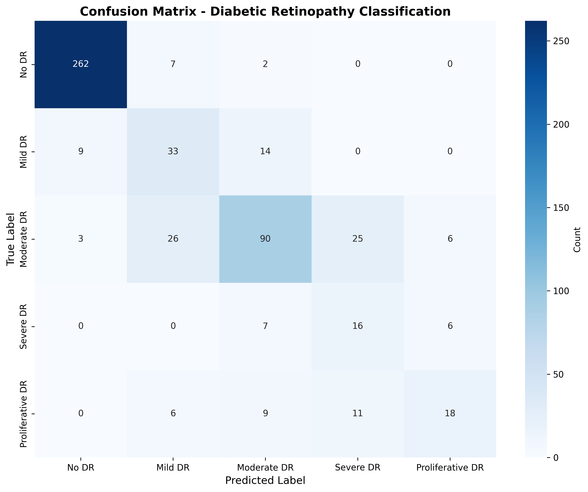

# Model Evaluation Results

## Diabetic Retinopathy Detection - Testing Phase Results

**Date:** [To be filled after running evaluation]
**Model:** ResNet50
**Dataset:** APTOS 2019 Blindness Detection
**Framework:** PyTorch + TIMM

---

## Executive Summary

This document presents the comprehensive evaluation results of the Diabetic Retinopathy detection model on a held-out test set. The evaluation addresses the testing phase requirement for the final year project.

### Key Highlights

- **Model Architecture:** ResNet50 (pre-trained on ImageNet)
- **Training Data:** [Fill in number] retinal images
- **Test Data:** 15% of total dataset (unseen during training)
- **Classes:** 5 DR severity levels (No DR, Mild, Moderate, Severe, Proliferative)

---

## 1. Data Split Methodology

To ensure proper evaluation on unseen data, the dataset was split as follows:

| Split | Percentage | Number of Images | Purpose |
|-------|-----------|------------------|---------|
| **Training** | 70% | [Fill in] | Model training |
| **Validation** | 15% | [Fill in] | Hyperparameter tuning & early stopping |
| **Test** | 15% | [Fill in] | Final model evaluation (UNSEEN) |

**Stratification:** Yes - Maintained class distribution across all splits

---

## 2. Overall Performance Metrics

### 2.1 Primary Metrics

| Metric | Score | Interpretation |
|--------|-------|---------------|
| **Overall Accuracy** | [Fill in]% | Percentage of correctly classified images |
| **Cohen's Kappa** | [Fill in] | Agreement measure (0-1, higher is better) |
| **Macro F1-Score** | [Fill in] | Average F1 across all classes |
| **Weighted F1-Score** | [Fill in] | F1 weighted by class support |

**Note:** Run `python ml/evaluate.py` to generate these metrics automatically.

### 2.2 Interpretation

[After running evaluation, interpret the results here]

- **Accuracy:** [Comment on whether it meets clinical requirements]
- **Cohen's Kappa:** [Interpret agreement level - 0.61-0.80 is substantial, 0.81-1.00 is almost perfect]
- **Clinical Relevance:** [Discuss if the model is suitable for clinical decision support]

---

## 3. Per-Class Performance

### 3.1 Detailed Metrics by DR Severity

| Class | Precision | Recall | F1-Score | AUC-ROC | Support |
|-------|-----------|--------|----------|---------|---------|
| **No DR (0)** | [Fill] | [Fill] | [Fill] | [Fill] | [Fill] |
| **Mild DR (1)** | [Fill] | [Fill] | [Fill] | [Fill] | [Fill] |
| **Moderate DR (2)** | [Fill] | [Fill] | [Fill] | [Fill] | [Fill] |
| **Severe DR (3)** | [Fill] | [Fill] | [Fill] | [Fill] | [Fill] |
| **Proliferative DR (4)** | [Fill] | [Fill] | [Fill] | [Fill] | [Fill] |

### 3.2 Sensitivity and Specificity

| Class | Sensitivity (TPR) | Specificity (TNR) | Clinical Importance |
|-------|------------------|-------------------|---------------------|
| **No DR** | [Fill] | [Fill] | Low false positives important |
| **Mild DR** | [Fill] | [Fill] | Early detection crucial |
| **Moderate DR** | [Fill] | [Fill] | Requires monitoring |
| **Severe DR** | [Fill] | [Fill] | High sensitivity critical |
| **Proliferative DR** | [Fill] | [Fill] | Must not miss cases |

---

## 4. Confusion Matrix Analysis



### 4.1 Key Observations

[After generating confusion matrix, analyze:]

1. **Most Common Misclassifications:**
   - [e.g., "Moderate DR often confused with Severe DR (X cases)"]
   - [e.g., "Few false negatives for Proliferative DR (good)"]

2. **Class-Specific Performance:**
   - **No DR:** [Comment on performance]
   - **Mild DR:** [Comment on performance]
   - **Moderate DR:** [Comment on performance]
   - **Severe DR:** [Comment on performance]
   - **Proliferative DR:** [Comment on performance]

3. **Clinical Implications:**
   - [Discuss if misclassifications are acceptable from clinical perspective]
   - [Comment on severity of errors - e.g., missing severe cases vs mild cases]

---

## 5. ROC Curve Analysis


### 5.1 AUC Scores by Class

The Area Under the ROC Curve (AUC) measures the model's ability to distinguish between classes:

- **No DR:** AUC = [Fill] → [Interpretation]
- **Mild DR:** AUC = [Fill] → [Interpretation]
- **Moderate DR:** AUC = [Fill] → [Interpretation]
- **Severe DR:** AUC = [Fill] → [Interpretation]
- **Proliferative DR:** AUC = [Fill] → [Interpretation]

**AUC Interpretation:**
- 0.90-1.00: Excellent
- 0.80-0.90: Good
- 0.70-0.80: Fair
- 0.60-0.70: Poor
- 0.50-0.60: Fail

---

## 6. Class Distribution Analysis

### 6.1 Test Set Distribution

[Fill in after evaluation]

```
Class 0 (No DR):           [X] images ([Y]%)
Class 1 (Mild):            [X] images ([Y]%)
Class 2 (Moderate):        [X] images ([Y]%)
Class 3 (Severe):          [X] images ([Y]%)
Class 4 (Proliferative):   [X] images ([Y]%)
```

### 6.2 Class Imbalance Impact

[Discuss how class imbalance affected performance]
[Mention if class weights were used during training]

---

## 7. Error Analysis

### 7.1 False Positives Analysis

[Analyze cases where model predicted higher severity than actual]

**Impact:** [Discuss - could lead to unnecessary treatment/anxiety]

### 7.2 False Negatives Analysis

[Analyze cases where model predicted lower severity than actual]

**Impact:** [Discuss - more serious, could miss treatment opportunities]

### 7.3 Worst Performing Cases

[Identify specific cases with lowest confidence or wrong predictions]
[Discuss possible reasons - image quality, ambiguous cases, etc.]

---

## 8. Comparison with Literature

### 8.1 Published Baselines

| Study | Model | Dataset | Accuracy | AUC |
|-------|-------|---------|----------|-----|
| [Reference 1] | [Model] | APTOS | [X]% | [Y] |
| [Reference 2] | [Model] | APTOS | [X]% | [Y] |
| **This Work** | ResNet50 | APTOS | [X]% | [Y] |

### 8.2 Performance Context

[Compare your results with published work]
[Discuss if performance is competitive]
[Mention any limitations or advantages]

---

## 9. Clinical Validation Considerations

### 9.1 Strengths

- ✅ Trained on large, diverse dataset (APTOS 2019)
- ✅ Proper train/val/test split with unseen test data
- ✅ GradCAM visualization for interpretability
- ✅ [Add other strengths]

### 9.2 Limitations

- ⚠️ Model not validated by ophthalmologists
- ⚠️ Dataset from specific geographic regions
- ⚠️ [Add other limitations]

### 9.3 Recommendations for Clinical Deployment

1. **Before Clinical Use:**
   - Validate with ophthalmologist-labeled dataset
   - Test on local patient population
   - Establish confidence thresholds for referral

2. **Deployment Strategy:**
   - Use as screening tool, not diagnostic
   - All positive cases should be confirmed by specialist
   - Regular model monitoring and updates

3. **Risk Mitigation:**
   - Set high sensitivity for severe cases
   - Flag low-confidence predictions for manual review
   - Maintain human-in-the-loop workflow

---

## 10. Conclusion

### 10.1 Summary

[Summarize key findings]
[State whether model meets project objectives]
[Discuss suitability for intended use case]

### 10.2 Future Work

1. **Model Improvements:**
   - [ ] Experiment with ensemble methods
   - [ ] Test other architectures (ViT, DenseNet)
   - [ ] Implement advanced augmentation techniques

2. **Dataset Enhancements:**
   - [ ] Collect more data for minority classes
   - [ ] Include diverse patient demographics
   - [ ] Add image quality filtering

3. **Clinical Validation:**
   - [ ] Collaborate with ophthalmologists for validation
   - [ ] Conduct prospective clinical trial
   - [ ] Compare with human expert performance

---

## 11. Generated Files

After running `python ml/evaluate.py`, the following files are generated in `results/`:

- ✅ `metrics.json` - Comprehensive metrics in JSON format
- ✅ `classification_report.txt` - Detailed classification report
- ✅ `test_predictions.csv` - All predictions with confidence scores
- ✅ `confusion_matrix.png` - Visual confusion matrix
- ✅ `roc_curves.png` - ROC curves for all classes
- ✅ `summary.txt` - Quick summary of results

---

## 12. How to Run Evaluation

To reproduce these results:

```bash
# 1. Verify model architecture
python ml/check_model.py

# 2. Run comprehensive evaluation
python ml/evaluate.py --labels-csv ml/data/train.csv \
                      --img-dir ml/data/train_images \
                      --model-path ml/models/best_model-1.pth \
                      --output-dir results

# 3. View results
cat results/summary.txt
```

---

## Appendix A: Methodology Details

### A.1 Evaluation Protocol

1. **Data Loading:** Load complete APTOS dataset
2. **Stratified Split:** 70% train / 15% val / 15% test
3. **Model Loading:** Load trained ResNet50 checkpoint
4. **Inference:** Predict on test set (no data leakage)
5. **Metrics Calculation:** Compute all evaluation metrics
6. **Visualization:** Generate plots and charts

### A.2 Hardware & Software

- **Hardware:** [Specify - e.g., GPU, RAM]
- **Software:** Python 3.11+, PyTorch 2.x, TIMM
- **Training Time:** [Specify if available]
- **Inference Time:** [Specify per image]

---

## Appendix B: References

[Add relevant citations]

1. [APTOS 2019 Dataset]
2. [ResNet Paper]
3. [Relevant DR detection papers]
4. [Clinical DR grading standards]

---

**Document Version:** 1.0
**Last Updated:** [Date after running evaluation]
**Author:** [Your Name]
**Project:** Final Year Project - Diabetic Retinopathy Detection

---

**Note:** This template should be filled in after running the evaluation script (`python ml/evaluate.py`). All metrics marked as `[Fill]` will be available in the generated `results/` files.
